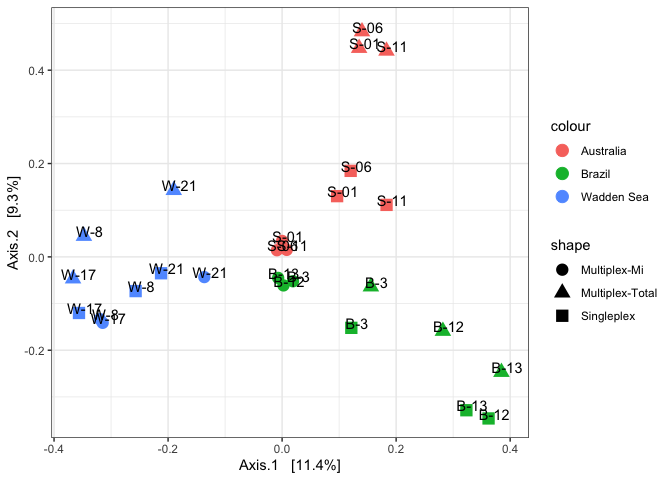
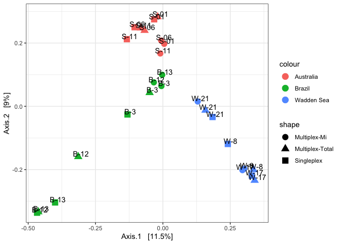

eDNAexpeditions_trialSamples_analysis
================
Saara Suominen
4/18/2023

# eDNA expeditions trial samples

This document shows the overall results of the eDNA expeditions trial
sample analysis.

The analysis consisted of a mixture of samples of

-   eDNA filters
-   control filters
-   pcr controls

Which were first amplified in 3 different types of reactions:

-   Mifish multiplex (all mifish and mimammal primers combined in one
    reaction)
-   All multiplex (all primers combined in one reaction)
-   All singleplex (all primers amplified separately, then combined for
    sequencing)

The samples are from the eDNA expeditions project, and are from three
locations:

-   Wadden Sea
-   Brazil
-   Australia

Positive samples (PCR bands detected) from each of the countries were
analysed.

The primers that were used for the analysis were:

-   Mifish-UE, Mimammal-UEB
-   COI (Leray fragment)
-   16S rRNA for vertebrates
-   Teleo 12S rRNA

The purpose of this analysis was to test the sample processing pipeline
and to understand which reaction type works best with the samples.

All sequences were analysed with the PacMAN pipeline, with each primer
set analysed separately. Cutadapt was used to search for the primer
sequences and discard any reads were the primer sequences were not
found. For the MifishUE and the Mimammal, the different primer sets in
each category were combined as a consensus sequence. Still there is a
large overlap within the seqeunces found by Mimammal and Mifish primers,
as the primers are very similar. The overlap in ASVs is removed in the
analysis stage.

The sequences were obtained with a paired run of a 150 bp Novaseq kit.
Only paired sequences from the mifish and mimammal analyses were merged
in the analysis. The COI and 16S rRNA markers were too long to be merged
(313 bp and 250 bp respectively) as the length of good quality sequences
for the 16S rRNA was also about 125 bp. For Teleo, it is a short read,
but there were large differences in the amount of primers recognized in
forward reads or reverse reads by cutadapt (possibly something to still
check why). Cutadapt removes reads if the other pair is not found in
paired-end mode, therefore the reads for teleo were run separately. In
this case, each read (both forward and reverse), cover the full range of
the marker.

A reference database built with the [reference database
creator](creator%20https://github.com/gjeunen/reference_database_creator)
either from ncbi or from the mitofish database (for the mifish primers),
and cut to the specific primer region that was used. Remaining unknown
sequences were searched against the full ncbi-nt database.

The sequence annotation in this first trial was not strict, with an 85%
identity cutoff for both the targeted database file and blast. Therefore
the annotation results need to be considered carefully.

## Upload phyloseq data

The PacMAN pipeline outputs the data in phyloseq format to make starting
the analysis easy. However, these are not names that have been checked
with the WoRMS database and therefore the DwC files should be used in
the final analysis.

    ## phyloseq-class experiment-level object
    ## otu_table()   OTU Table:         [ 10251 taxa and 45 samples ]
    ## sample_data() Sample Data:       [ 45 samples by 22 sample variables ]
    ## tax_table()   Taxonomy Table:    [ 10251 taxa by 14 taxonomic ranks ]
    ## refseq()      DNAStringSet:      [ 10251 reference sequences ]

    ## phyloseq-class experiment-level object
    ## otu_table()   OTU Table:         [ 10097 taxa and 45 samples ]
    ## sample_data() Sample Data:       [ 45 samples by 22 sample variables ]
    ## tax_table()   Taxonomy Table:    [ 10097 taxa by 14 taxonomic ranks ]
    ## refseq()      DNAStringSet:      [ 10097 reference sequences ]

    ## phyloseq-class experiment-level object
    ## otu_table()   OTU Table:         [ 21015 taxa and 30 samples ]
    ## sample_data() Sample Data:       [ 30 samples by 23 sample variables ]
    ## tax_table()   Taxonomy Table:    [ 21015 taxa by 14 taxonomic ranks ]
    ## refseq()      DNAStringSet:      [ 21015 reference sequences ]

    ## phyloseq-class experiment-level object
    ## otu_table()   OTU Table:         [ 2321 taxa and 30 samples ]
    ## sample_data() Sample Data:       [ 30 samples by 21 sample variables ]
    ## tax_table()   Taxonomy Table:    [ 2321 taxa by 14 taxonomic ranks ]
    ## refseq()      DNAStringSet:      [ 2321 reference sequences ]

    ## phyloseq-class experiment-level object
    ## otu_table()   OTU Table:         [ 1004 taxa and 30 samples ]
    ## sample_data() Sample Data:       [ 30 samples by 22 sample variables ]
    ## tax_table()   Taxonomy Table:    [ 1004 taxa by 14 taxonomic ranks ]
    ## refseq()      DNAStringSet:      [ 1004 reference sequences ]

To avoid the issue of duplication on Mifish/Mimammal reads, keep only
unique mimammal reads for merging (and use the same sample names)

    ## [1] 8727

    ## phyloseq-class experiment-level object
    ## otu_table()   OTU Table:         [ 35961 taxa and 45 samples ]
    ## sample_data() Sample Data:       [ 45 samples by 23 sample variables ]
    ## tax_table()   Taxonomy Table:    [ 35961 taxa by 14 taxonomic ranks ]
    ## refseq()      DNAStringSet:      [ 35961 reference sequences ]

## Reads

First look at the of the amount of reads in different categories:


The first thing we can see is that there is bacterial reads in
significant amounts only in the eDNA filters with the Multiplex-total
reaction type.

This is likely because there are more bacteria in the environmental
samples and these are picked up by a combination of factors in the
multiplexing (also seen in multiple bands in the PCR).

We are also interested to understand which part of the reads can be
attributed to the different primer analyses? Look at amount of total
reads that were sequences for each sample:


In many samples a large part of the reads survived until the analysis.
Only for the singleplex, there is a clear lack of sequences, and it will
be important to check what the remaining reads are, is there a reason
that primers are not recognized by cutadapt in these sequences, or is
something else going on?

The difference in which primers contributed to the sequences in which
reaction type is likewise difficult to understand. The expectation would
be that in the singleplex run, there would be an equal amount of reads
from each primer type, as these were mixed after the PCR (in equimolar
amounts? how were the samples cleaned?).

## Taxonomic composition of reads

To look closer into the taxonomic composition of the the samples, we
will subset.


It is clear that most of the reads and relative abundance is human DNA
(not shown, but the violet color is Primates). However good news is that
for the eDNA samples there is less human reads.

Since the reference databases are known to be lacking, and we can expect
that there are not several instances of the rare species that we are
looking for, we will need to change how the blast-lca is working: less
targets evaluated? More stringent criteria? (i.e. 97% similarity). Or
simply take only the first blast hit? This should be tested with the
help of mock communities, or a mock dataset.

## Remove control sequences

Remove ASVs that are found in the control samples from eDNA samples.
This will allow to evaluate the ‘real’ sequences that are found. This
can be done also at the level of the PacMAN pipeline also, but I have
left them in so that we can look at them in detail.

    ##    Min. 1st Qu.  Median    Mean 3rd Qu.    Max. 
    ## 0.04638 0.46578 0.66828 0.64031 0.87332 1.00000


The amount of reads that are not from the controls has a lot to do with
the samples, but also the reaction type (multiplex total). There is a
large variation between the samples. It is important to check if this
can be traced back to DNA-yield, or PCR efficiency possibly, so that
critical steps in the lab can be optimized.

### Number of fish reads

If we subset this data only for fish, what is the amount of reads in
each sample?


Try ordination to see how different/similar the samples from different
locations are:


The first ordination does not show separation, because the human reads
are so prevalent. Instead the ordination will be done only with eDNA
samples.

``` r
#The data with only the sample info (no control asvs.)
#pseqs_merged_rel_eDNA_nocontrol_euk=subset_taxa(pseqs_merged_rel_eDNA_nocontrol, kingdom=="Eukaryota")
pseq.ord <- ordinate(pseqs_merged_rel_eDNA_nocontrol, "PCoA", "bray")

plot_ordination(pseqs_merged_rel_eDNA_nocontrol, pseq.ord) +
  geom_point(aes(color=Country, shape= ReactionType), size=4) +
  geom_text(label=pseqs_merged_rel_eDNA_nocontrol@sam_data$Sample_name, nudge_x = 0.01, nudge_y = 0.01) +
  theme_bw()
```

<!-- -->

Here we see that the multiplex total reads separate from the remaining
reads. This is likely mostly affected by the bacterial reads found in
the samples.

Without bacterial reads:



In this way we see more clearly the separation by site. Some of the
low-abundance samples are clustering together, as there is not enough
data.

A closer look at the taxonomic composition of the eDNA samples:


We can see that the majority of reads are from phylum Chordata and class
Actinopteri (i.e. fish), as targeted.

## Number of ASVs

We also want to check what is the number of different ASVs (annotated
species) in the different samples.


## Number of different taxonomic ranks assigned at each level:

Here we check the number of different names found in each sample.


We can see that most annotations are at the genus and family level. The
low number of names in the Brazilian samples is clear also in the other
steps of the analysis, low amounts of reads compared to other samples.
Likely this is therefore due to issues in sampling. However it seems
that there are still a good amount of reads in the other categories than
mifish, could the issue therefore be more about a lack of fish dna in
the samples?

Run the same analysis for only fish:


## Conclusions

Conclusions from the different steps of the analysis:

-   Bacterial reads in significant amounts only in the eDNA filters with
    the Multiplex-total reaction type.

    -   Multiplexing all primers likely results in the amplification of
        reads not in the target range
    -   Either due to the combination of the different primers, or the
        unspecificity of the used annealing temperature

-   Most reads from the original sequencing files were analysed in the
    pipeline

    -   Still unclear:
    -   Why was a smaller portion of the singleplex reads picked up by
        the pipeline (likely cutadapt?)
    -   The reason for why the singleplex reads were not better
        distributed across the different primers is not clear
    -   Why were teleo reads poorly recognized (i.e. f and r reads) in
        the singleplex reactions? A cutadapt issue?

-   Large proportion of reads were human, but on average 58% of reads in
    the eDNA samples were from environmental sources

-   Most analysed environmental reads were fish as targeted

-   The amount of species names differed largely between samples

    -   For Brazil in fact very few fish species (but the amount of
        other species was as high as the other samples)
    -   This indicates that there likely was not enough eDNA of fish in
        the samples to enable analysis.
